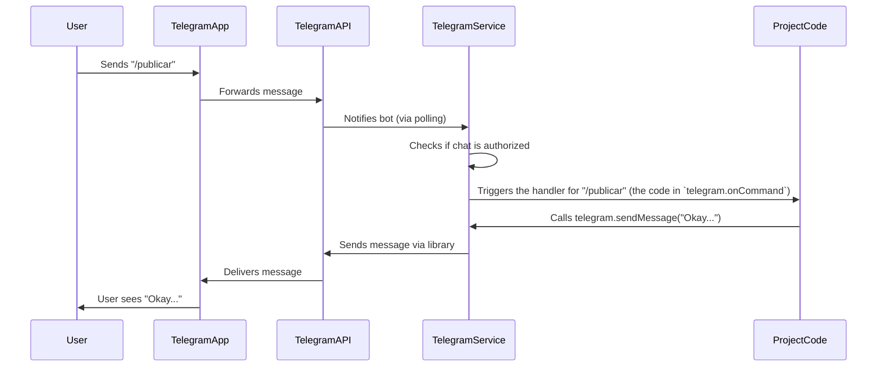

# Chapter 1: Telegram Service

Welcome to the tutorial for `vimeo-to-wp`! This project helps automate the process of taking videos from Vimeo and publishing them as posts on a WordPress site. But instead of just being a simple script that runs by itself, it has a cool feature: you can interact with it using Telegram!

This first chapter is all about the **Telegram Service**. Think of it as the friendly face (or chat interface!) of our project.

## What is the Telegram Service?

Imagine you want to publish a video, but you need the program to ask you something first, like "Hey, I found a new video, should I publish it?" or "Which trainer's picture should I use for this post?". The Telegram Service is the part that makes this possible.

Its main job is to:

1.  **Listen:** Wait for messages or commands you send in a specific Telegram chat.
2.  **Talk:** Send messages back to you, providing updates, asking questions, or reporting errors.
3.  **Interact:** Understand your responses to questions (like clicking a 'Yes' button).

Basically, it turns the video publishing process into a conversation you have with the program through Telegram.

## How the Telegram Service Makes Things Interactive

Let's look at a simple example of how you might use this:

1.  You (or an automated schedule) tell the project to check for a new video.
2.  The **Telegram Service** sends you a message: "🔍 Checking Vimeo for a new video..."
3.  Once found, it sends another message: "✅ Found video: [Video Title]"
4.  Crucially, it then asks you a question: "🤔 Do you want to publish this video? [Link to video]". Below the message, you see two buttons: "Yes" and "No".
5.  You click "Yes".
6.  The **Telegram Service** receives your "Yes" answer.
7.  It might ask another question, like "👤 Select the trainer for the thumbnail:", showing buttons with trainer names.
8.  You click a trainer name.
9.  The **Telegram Service** receives your choice and tells the project to continue publishing with that trainer's image.
10. Finally, it sends a success message: "🎉 Video published! [Link to WordPress post]"

This back-and-forth is all handled by the **Telegram Service**.

## Using the Telegram Service in the Code

You don't need to know *how* the Telegram Service talks to Telegram internally to use it. You just need to know how to ask it to do things, like sending a message or asking a question.

The project creates an instance of the `TelegramService` early on (you can see this in `src/scripts/telegram-bot.ts`):

```typescript
import { TelegramService } from "../services/telegram";
// ... other imports

const telegram = new TelegramService();

// ... rest of the script
```

This line simply creates an object named `telegram` that we can use to talk to Telegram.

Now, let's see some simple ways to use this `telegram` object.

To send a basic message:

```typescript
await telegram.sendMessage("Hello from the bot!");
```

This will send the text "Hello from the bot!" to the configured Telegram chat.

To set up a command, like `/publicar`:

```typescript
telegram.onCommand("publicar", async () => {
  // Code to run when someone sends "/publicar"
  await telegram.sendMessage("Okay, checking for a video...");
  // ... then maybe call the publishing logic
});
```

This code says: "Hey `telegram` object, when you hear the command `/publicar`, run this specific set of instructions."

Asking a simple Yes/No question is a bit more involved because the code needs to *wait* for the user's response. The `askForPublishing` method handles this:

```typescript
const latestVideoLink = "https://vimeo.com/..." // Example link
const shouldPublish = await telegram.askForPublishing(latestVideoLink);

if (shouldPublish) {
  await telegram.sendMessage("Great! Let's publish.");
} else {
  await telegram.sendMessage("Okay, cancelling publish.");
}
```

Notice the `await` keyword. The program will pause at the `askForPublishing` line, send the message with buttons, wait for the user to click one, and then `shouldPublish` will be `true` or `false` based on the click.

There's a similar method for asking the user to choose a trainer from a list:

```typescript
const dayNumber = 1; // Example: Monday
const trainerImageUrl = await telegram.askForTrainer(dayNumber);

await telegram.sendMessage(`You selected trainer image URL: ${trainerImageUrl}`);
// ... use trainerImageUrl for publishing
```

Again, `await` makes the program wait for the user's selection from the buttons the bot presents. The method returns the URL of the chosen trainer's image. (We'll learn more about where this trainer info comes from in later chapters like [ACF Daily Configuration](04_acf_daily_configuration_.md)).

Finally, there are helper methods to send specific types of messages:

```typescript
// After a successful publication
await telegram.sendSuccessMessage("https://your-wordpress.com/new-post");

// If something went wrong
await telegram.sendErrorMessage("Failed to fetch video from Vimeo.");
```

These methods just format the text nicely for success or error reports.

## Under the Hood: How it Works

How does the `TelegramService` actually talk to Telegram?

It uses a special library called `node-telegram-bot-api`. This library connects to Telegram's official system (the Telegram Bot API).

Here's a simplified look at how a command like `/publicar` travels:



When the `TelegramService` is asking a question with buttons (like `askForPublishing`), it sends a message with special "inline keyboard" buttons. When the user clicks a button, Telegram sends a specific type of update back to the bot, which the `TelegramService` is listening for using `bot.once('callback_query', ...)`. This is how it knows which button was clicked and can return the user's answer.

Inside the `src/services/telegram.ts` file, you can see the core logic:

```typescript
import TelegramBot from "node-telegram-bot-api";
import { validateEnv } from "../config/env"; // Used for getting tokens

const { TELEGRAM_BOT_TOKEN, TELEGRAM_CHAT_ID } = validateEnv();

export class TelegramService {
  private bot: TelegramBot;
  private chatId: string;

  constructor() {
    // Create a new bot instance using the token
    this.bot = new TelegramBot(TELEGRAM_BOT_TOKEN, { polling: true });
    // Store the allowed chat ID
    this.chatId = TELEGRAM_CHAT_ID;
  }

  // Checks if the incoming message is from the correct chat
  private isAuthorizedChat(chatId: number | string): boolean {
    return chatId.toString() === this.chatId;
  }

  // Sets up a listener for a specific command
  public onCommand(
    command: string,
    handler: (msg: TelegramBot.Message) => void
  ) {
    this.bot.onText(new RegExp(`^\\/${command}$`), async (msg) => {
      // Check authorization before running the command handler
      if (!this.isAuthorizedChat(msg.chat.id)) {
        // Send unauthorized message
        await this.bot.sendMessage( /*...*/ );
        return;
      }
      // If authorized, run the provided handler function
      await handler(msg);
    });
  }

  // Sends a simple text message
  public async sendMessage(text: string): Promise<void> {
    await this.bot.sendMessage(this.chatId, text);
  }

  // ... methods like askForPublishing, askForTrainer, etc. use this.bot.sendMessage with reply_markup
  // ... and listen for 'callback_query' using this.bot.once to get button clicks
}
```

Key things to notice in the code snippet:

*   It uses `TELEGRAM_BOT_TOKEN` and `TELEGRAM_CHAT_ID`. These are special secret values you'll need to set up so the bot knows which bot it is and which chat it should listen to. We'll cover environment configuration in a later chapter: [Environment Configuration](06_environment_configuration_.md).
*   The `isAuthorizedChat` method adds a basic security check, ensuring only messages from your specific chat ID are processed for commands.
*   `this.bot.onText` is the underlying method from the `node-telegram-bot-api` library that listens for patterns in messages (we use it to match commands like `/publicar`).
*   `this.bot.sendMessage` sends messages.
*   The `askForPublishing` and `askForTrainer` methods are more complex; they send messages with buttons using the `reply_markup` option and then temporarily listen (`bot.once`) for the user's button click response before the function finishes.

## Conclusion

The **Telegram Service** is the project's communication hub with you. It handles receiving commands, sending updates, and managing interactive questions via Telegram chat. This makes the project much more user-friendly and controllable than a simple automated script.

Now that you understand how the project talks to you, let's look at how it gets the videos it needs to publish. The next chapter will introduce the [Vimeo Service](02_vimeo_service_.md).

---

<sub><sup>Generated by [AI Codebase Knowledge Builder](https://github.com/The-Pocket/Tutorial-Codebase-Knowledge).</sup></sub> <sub><sup>**References**: [[1]](https://github.com/Jarrioja/vimeo-to-wp/blob/2da693d29af45c519c030c2692b3d009d32b4568/src/scripts/telegram-bot.ts), [[2]](https://github.com/Jarrioja/vimeo-to-wp/blob/2da693d29af45c519c030c2692b3d009d32b4568/src/services/telegram.ts)</sup></sub>