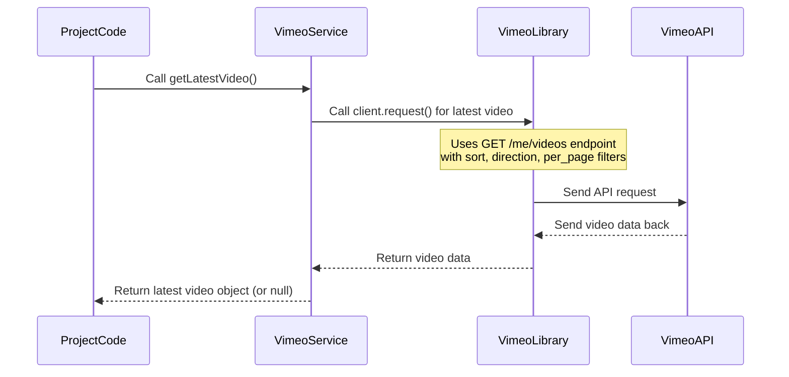

# Chapter 2: Vimeo Service

In the last chapter, we learned about the [Telegram Service](01_telegram_service_.md), the friendly part of our project that lets us talk to the program using Telegram chat. It listens for commands and sends us messages and questions.

Now, let's shift our focus to where the videos come from. Our project's job is to take videos from Vimeo and put them on WordPress. But how does the project actually *get* the video details from Vimeo? How does it tell Vimeo to change settings like privacy?

This is where the **Vimeo Service** comes in.

## What is the Vimeo Service?

Imagine the [Telegram Service](01_telegram_service_.md) is the project's voice talking *to you*, the user. The **Vimeo Service** is the project's voice talking *to Vimeo*.

It's the dedicated assistant whose only job is to communicate with the Vimeo platform. It uses a special connection (called an **API**, which stands for Application Programming Interface – basically a way for two computer systems to talk to each other) to ask Vimeo questions and tell it to do things.

Think of it like this:

*   The project needs to find the newest video you uploaded. It asks the **Vimeo Service**.
*   The **Vimeo Service** knows the correct way to ask Vimeo (using the API).
*   Vimeo finds the video and sends the details back to the **Vimeo Service**.
*   The **Vimeo Service** gives those details back to the project.

Its main responsibilities include:

1.  **Finding Videos:** Fetching lists of videos based on criteria (like the most recent ones).
2.  **Getting Video Details:** Retrieving all information about a specific video using its unique ID.
3.  **Updating Video Settings:** Changing things like a video's privacy settings on Vimeo.

It takes the complicated steps of talking to the Vimeo API and wraps them up into simple, easy-to-use functions for the rest of the project.

## How the Vimeo Service Helps Publish Videos

Let's revisit the main use case we saw in the [Telegram Service](01_telegram_service_.md) chapter: publishing the latest video.

1.  The project logic starts the publishing process (maybe you sent the `/publicar` command via Telegram).
2.  It needs to know which video to publish. It uses the **Vimeo Service** to ask, "Hey Vimeo Service, what's the latest video in my account?"
3.  The **Vimeo Service** does the behind-the-scenes work (talking to the Vimeo API) and returns the details of the newest video.
4.  Later, *before* the video is put on WordPress, the project might need to make sure the video can only be embedded on specific websites (like your WordPress site) and not viewed directly on Vimeo. It uses the **Vimeo Service** again to say, "Vimeo Service, please change the privacy of this video so it's embed-only."
5.  The **Vimeo Service** sends the correct instructions to the Vimeo API to update the video settings.

This interaction with Vimeo is crucial for the publishing process.

## Using the Vimeo Service in the Code

Just like the [Telegram Service](01_telegram_service_.md), you don't need to worry too much about *how* the Vimeo Service talks to Vimeo. You just need to know how to ask it to do things.

In the project code, you'll see an instance of the `VimeoService` being created (for example, in `src/scripts/telegram-bot.ts`):

```typescript
import { VimeoService } from "../services/vimeo";
// ... other imports

const telegram = new TelegramService(); // From previous chapter
const vimeo = new VimeoService(); // <-- Here's our Vimeo Service instance

// ... rest of the script
```

This line creates an object named `vimeo` that we can use to interact with Vimeo.

Now, let's see how the `publishLatestVideo` function (which we saw in Chapter 1) uses this `vimeo` object:

```typescript
async function publishLatestVideo() {
  try {
    // ... Telegram message part ...

    // Get latest video from Vimeo
    const latestVideo = await vimeo.getLatestVideo(); // <-- Using the vimeo object
    if (!latestVideo) {
      // ... handle no video found ...
      return;
    }

    // ... Telegram message part ...

    // ... rest of the publishing logic ...

    // Inside publishVideoToWordPress (which gets the 'vimeoService' instance)
    // Configurar privacidad del video
    console.log("🔒 Configurando privacidad del video...");
    await vimeoService.setVideoEmbedOnly(video.uri.split("/").pop()!); // <-- Using another method
    console.log("✅ Privacidad configurada");

    // ... rest of publishVideoToWordPress ...

  } catch (error) {
    // ... error handling ...
  }
}
```

Let's break down the key methods used here:

*   `await vimeo.getLatestVideo()`: This tells the `vimeo` object to go find the most recently uploaded video on your Vimeo account. The `await` means the program will pause here until the Vimeo Service finishes talking to Vimeo and returns the video details. If a video is found, the `latestVideo` variable will hold all its information (like title, description, link, etc.). If not, it will be `null`.

*   `await vimeoService.setVideoEmbedOnly(video.uri.split("/").pop()!)`: This is called later in the process (inside the `publishVideoToWordPress` function, which gets passed the `vimeoService` instance). The `video.uri.split("/").pop()!` part is just a way to get the video's unique ID from its URL (like getting `123456789` from `/videos/123456789`). You give this ID to `setVideoEmbedOnly`, and it tells the Vimeo Service to update *that specific video's* settings so it can only be embedded via code on allowed sites. Again, `await` makes the program wait for this update to complete on Vimeo's side.

There are other methods too, like `getVideoById(videoId)` which is similar to `getLatestVideo` but gets a specific video you already know the ID for, and `updateVideoPrivacy(videoId, update)` which is a more general way to change various privacy settings. The `setVideoEmbedOnly` method is actually a simplified way to use `updateVideoPrivacy` with specific settings pre-defined for our use case.

## Under the Hood: How it Talks to Vimeo

So, how does the `VimeoService` actually communicate with Vimeo's API?

It uses a specialized software library called `@vimeo/vimeo`. This library acts as a convenient wrapper around the raw Vimeo API calls. Instead of having to manually build complex web requests, the library provides functions like `client.request()`.

Here's a simplified look at what happens when `getLatestVideo()` is called:



When you call a method on the `VimeoService` object, it uses the underlying `@vimeo/vimeo` client object (`this.client`) to make the actual request to the Vimeo API. The library handles the details like formatting the request, adding necessary authentication, and interpreting the response from Vimeo.

Let's look at some parts of the `src/services/vimeo.ts` file:

```typescript
import { Vimeo } from "@vimeo/vimeo"; // Import the library
import { validateEnv } from "../config/env"; // Used for getting API keys

const env = validateEnv();
// Initialize the Vimeo client using keys from environment
const vimeoClient = new Vimeo(
  env.VIMEO_CLIENT_ID,
  env.VIMEO_CLIENT_SECRET,
  env.VIMEO_ACCESS_TOKEN
);

export class VimeoService {
  private client: Vimeo; // Holds the initialized client instance

  constructor() {
    this.client = vimeoClient; // Store the client when the service is created
  }

  async getVideos(filters: any = {}): Promise<any> { // Simplified type
    try {
      const response = await new Promise((resolve, reject) => {
        // Use the client to make a GET request to the videos endpoint
        this.client.request(
          {
            method: "GET",
            path: "/me/videos",
            query: filters, // Add filters like sort, per_page
          },
          (err: any, body: any) => { // Callback function when request is done
            if (err) reject(err); // Handle errors
            resolve(body); // Resolve the promise with the response body
          }
        );
      });
      return response; // Return the received data
    } catch (error) {
      console.error("❌ Error al obtener videos:", error);
      throw error;
    }
  }

  // getLatestVideo calls getVideos internally with specific filters
  async getLatestVideo(): Promise<any | null> { // Simplified type
    return new Promise((resolve, reject) => {
      this.client.request( // Use the client again
        {
          method: "GET",
          path: "/me/videos",
          query: { // These filters ask for the single latest video
            per_page: 1,
            sort: "date",
            direction: "desc",
          },
        },
        (error: any, body: any) => { // Callback
          if (error) {
            reject(error);
            return;
          }
          // Process the response body to get the video data
          const videos = body.data;
          if (!videos || videos.length === 0) {
            resolve(null); // Return null if no videos found
            return;
          }
          resolve(videos[0]); // Return the first (latest) video
        }
      );
    });
  }

  // setVideoEmbedOnly calls updateVideoPrivacy
  async setVideoEmbedOnly(videoId: string): Promise<any> { // Simplified type
    return this.updateVideoPrivacy(videoId, { // Uses updateVideoPrivacy
      privacy: { // Specific privacy settings for embed-only
        view: "disable", // Hide from Vimeo site
        embed: "whitelist", // Allow embedding on specific sites
        download: false,
        add: false,
        comments: "nobody",
      },
    });
  }

  async updateVideoPrivacy(videoId: string, update: any): Promise<any> { // Simplified type
     try {
      const response = await new Promise((resolve, reject) => {
        // Use the client to make a PATCH request to update a specific video
        this.client.request(
          {
            method: "PATCH", // PATCH method is used to update existing data
            path: `/videos/${videoId}`, // Path includes the specific video ID
            query: update, // The update object contains the new settings
          },
          (err: any, body: any) => {
            if (err) reject(err);
            resolve(body);
          }
        );
      });
      return response as any;
    } catch (error) {
      console.error("❌ Error al actualizar el video:", error);
      throw error;
    }
  }
}
```

Notice these key points:

*   The `VimeoService` constructor creates and holds an instance of the `@vimeo/vimeo` client (`this.client`).
*   It uses `env.VIMEO_CLIENT_ID`, `env.VIMEO_CLIENT_SECRET`, and `env.VIMEO_ACCESS_TOKEN`. These are secret keys provided by Vimeo that allow our project to securely access your account's information. We'll learn how to set these up in the [Environment Configuration](06_environment_configuration_.md) chapter.
*   Methods like `getVideos`, `getLatestVideo`, and `updateVideoPrivacy` all internally use `this.client.request(...)`. This is the core function from the `@vimeo/vimeo` library that performs the actual communication with Vimeo's API.
*   `getLatestVideo` is built on top of `getVideos` by providing specific `query` parameters (`per_page`, `sort`, `direction`).
*   `setVideoEmbedOnly` is built on top of `updateVideoPrivacy` by providing the specific `privacy` object needed for that setting.

This structure makes the `VimeoService` a clean interface. The rest of the application code doesn't need to know about `client.request`, `GET` vs `PATCH` methods, or specific API paths like `/me/videos`. It just calls easy-to-understand methods like `getLatestVideo()` and `setVideoEmbedOnly()`.

## Conclusion

The **Vimeo Service** acts as the project's dedicated translator for communicating with Vimeo. It handles fetching video information, applying filters to find specific videos (like the latest one), and updating video settings via the Vimeo API. By encapsulating these interactions, it keeps the main project logic clean and focused on the overall publishing workflow.

Now that we know how the project gets video data from Vimeo and how it talks to you via Telegram, the next piece of the puzzle is understanding how it interacts with WordPress to create the actual blog posts. The next chapter will introduce the [WordPress Service](03_wordpress_service_.md).

---

<sub><sup>Generated by [AI Codebase Knowledge Builder](https://github.com/The-Pocket/Tutorial-Codebase-Knowledge).</sup></sub> <sub><sup>**References**: [[1]](https://github.com/Jarrioja/vimeo-to-wp/blob/2da693d29af45c519c030c2692b3d009d32b4568/src/index.ts), [[2]](https://github.com/Jarrioja/vimeo-to-wp/blob/2da693d29af45c519c030c2692b3d009d32b4568/src/scripts/telegram-bot.ts), [[3]](https://github.com/Jarrioja/vimeo-to-wp/blob/2da693d29af45c519c030c2692b3d009d32b4568/src/services/vimeo.ts), [[4]](https://github.com/Jarrioja/vimeo-to-wp/blob/2da693d29af45c519c030c2692b3d009d32b4568/src/types/vimeo.d.ts), [[5]](https://github.com/Jarrioja/vimeo-to-wp/blob/2da693d29af45c519c030c2692b3d009d32b4568/src/types/vimeo.ts), [[6]](https://github.com/Jarrioja/vimeo-to-wp/blob/2da693d29af45c519c030c2692b3d009d32b4568/src/use-cases/publish-video-to-wordpress.ts)</sup></sub>