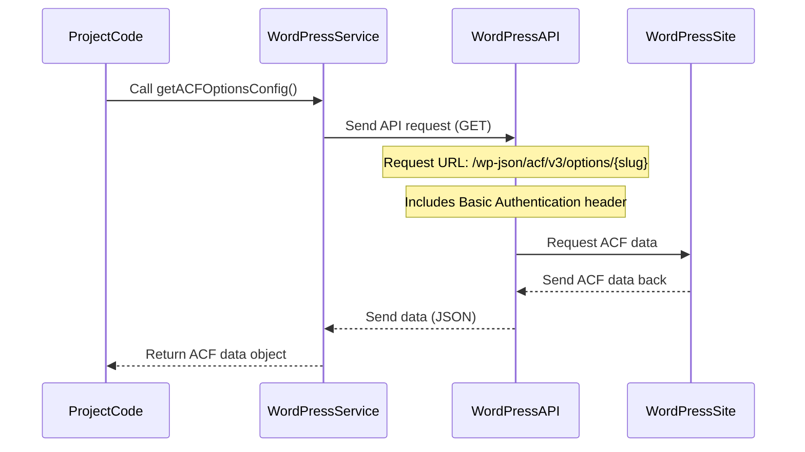

# Chapter 3: WordPress Service

In the previous chapters, we met the project's assistants for talking to you ([Telegram Service](01_telegram_service_.md)) and for getting video details from Vimeo ([Vimeo Service](02_vimeo_service_.md)).

Now, it's time to introduce the part of the project that connects with your WordPress website. This is the **WordPress Service**.

## What is the WordPress Service?

Think of the **WordPress Service** as the project's dedicated assistant whose job is to interact *directly* with your WordPress site. Just like the [Vimeo Service](02_vimeo_service_.md) talks to Vimeo using its API, the WordPress Service talks to WordPress using *its* API (Application Programming Interface).

Its main role is to handle everything related to getting information from and putting information onto your WordPress site. It's the central hub for all WordPress communication within the project.

Here are its key tasks:

1.  **Get Configuration:** It can fetch special settings stored on your WordPress site, particularly those managed by the Advanced Custom Fields (ACF) plugin. This includes things like which category to use or trainer image IDs for a specific day.
2.  **Create Posts:** It can create new blog posts (or other types of content, called Custom Post Types, or CPTs) on your WordPress site. This is how the video class gets its own page.
3.  **Update Posts:** It can change existing posts.
4.  **Publish Posts:** It can change a post's status from draft to published, making it visible to the public.
5.  **Upload Media:** It can take an image from a web address (a URL) and upload it to your WordPress Media Library, so it can be used as a featured image for a post.

By having a single **WordPress Service** handle all these interactions, the rest of the project doesn't need to worry about the technical details of talking to WordPress. It just tells the WordPress Service what it needs.

## How the WordPress Service Helps Publish Videos

Let's see how the WordPress Service fits into the main publishing workflow we've discussed:

1.  The project starts (maybe triggered by a Telegram command).
2.  The [Telegram Service](01_telegram_service_.md) interacts with you, confirming the video and asking for the trainer.
3.  The [Vimeo Service](02_vimeo_service_.md) finds the latest video and gets its details.
4.  Now, the project needs information specific to *your* WordPress setup for today's class. It asks the **WordPress Service** to get the daily configuration settings stored in ACF.
5.  Based on the trainer you selected via Telegram, the project asks the **WordPress Service** to upload the selected trainer's image URL to your WordPress Media Library. The WordPress Service does this and returns the ID of the newly uploaded image.
6.  The project then tells the **WordPress Service** to create a *new post*. It provides all the details like the title, the video embed code (from Vimeo), the category (from the ACF config), and the featured image ID (from the upload step).
7.  Finally, the project might tell the **WordPress Service** to *publish* the post it just created (or leave it as a draft).

The **WordPress Service** is essential because it's the only part that knows *how* to perform these actions on your WordPress site.

## Using the WordPress Service in the Code

Similar to the other services, you interact with the **WordPress Service** by creating an instance of it and calling its methods.

You don't usually create a single `WordPressService` instance like with Telegram or Vimeo because its methods are defined as simple functions that directly interact with the API. This makes them easy to use anywhere they are needed. You can see these functions being imported and used in `src/use-cases/publish-video-to-wordpress.ts`:

```typescript
import {
  createPost, // Function to create a post
  publishPost, // Function to publish a post
  getACFOptionsConfig, // Function to get ACF config
  uploadMediaFromUrl, // Function to upload media
} from "../services/wordpress"; // Import functions from the WordPress Service file

// ... other imports and logic
```

Here's how some of these functions are used in the `publishVideoToWordPress` logic:

```typescript
async function publishVideoToWordPress(options: PublishVideoOptions) {
  // ... logic to determine day, get video from Vimeo ...

  // 1. Get Configuration
  console.log("📋 Obteniendo configuración de WordPress...");
  const wpConfig = await getACFOptionsConfig(); // Call the function to get ACF data

  if (!wpConfig) {
    throw new Error("No se pudo obtener la configuración de WordPress");
  }
  // wpConfig now holds the ACF data fetched from WordPress

  // ... logic to get category ID and other info from wpConfig ...

  // 2. Upload Media (if needed)
  let featuredMediaId: number | undefined;
  if (options.thumbnailUrl) { // options.thumbnailUrl holds the URL of the trainer image
    console.log("🖼️ Subiendo imagen destacada...");
    // Call the function to upload the image from its URL
    featuredMediaId = await uploadMediaFromUrl(options.thumbnailUrl);
    console.log("✅ Imagen subida con ID:", featuredMediaId);
  }

  // 3. Create the Post
  console.log("📝 Creando post en WordPress...");
  const post = await createPost({ // Call the function to create the post
    title: "Your Post Title Here", // Example title
    content: "<p>Your video embed code here</p>", // Example content
    status: "draft", // Start as draft
    categoria_de_clase_grabada: [categoryId], // Add category ID from config
    featured_media: featuredMediaId, // Add the uploaded image ID
    acf: { // Data for ACF fields in the post
      video_id: "...",
      video_url: "...",
      video_duration: 123,
      day_number: 1,
      trainers: "...",
    },
  });
  console.log("✅ Post creado con ID:", post.id);
  // 'post' variable now contains details about the newly created post

  // 4. Publish the Post (if needed)
  if (options.forcePublish) {
     console.log("🌐 Publicando post...");
     await publishPost(post.id!); // Call the function to publish using the post ID
     console.log("✅ Post publicado!");
  }

  // ... rest of the function
}
```

Let's quickly look at the core functions:

*   `await getACFOptionsConfig()`: This function reaches out to your WordPress site and fetches the entire configuration data stored in the ACF options page. It returns a JavaScript object containing all that data.
*   `await uploadMediaFromUrl(imageUrl)`: You give this function the web address (`imageUrl`) of an image. It downloads the image and uploads it to your WordPress Media Library. It then returns the ID number that WordPress assigned to that media item. This ID is what WordPress uses to link a featured image to a post.
*   `await createPost(data)`: You give this function an object (`data`) containing all the details for the new post (title, content, categories, featured image ID, ACF fields, etc.). It tells WordPress to create the post and returns an object containing the details of the post that was just created, including its ID and URL.
*   `await publishPost(postId)`: You give this function the ID of a post. It tells WordPress to change that post's status to "publish".

These are just a few examples; the `src/services/wordpress.ts` file contains other functions like `updatePost` and `getPost` as well.

## Under the Hood: How it Talks to WordPress

The **WordPress Service** communicates with WordPress primarily through its **REST API**. This is a standard way for other programs to interact with WordPress data (posts, pages, users, media, etc.).

Here's a simplified sequence of how getting the ACF configuration works:



When you call a function like `getACFOptionsConfig`, the code in `src/services/wordpress.ts` does the following:

1.  It builds the correct web address (URL) for the WordPress API endpoint it needs to access. For ACF options, this is usually `/wp-json/acf/v3/options/{your_options_slug}`. For posts, it's `/wp-json/wp/v2/{your_cpt_slug}`. For media, it's `/wp-json/wp/v2/media`.
2.  It includes necessary information in the request, such as **authentication**. The project uses "Basic Authentication" with a username and password. **Important:** For security, you should use a special "Application Password" generated in your WordPress user profile settings instead of your main WordPress password. This is explained more in the [Environment Configuration](06_environment_configuration_.md) chapter.
3.  It uses the `fetch` function (a standard way to make web requests in modern JavaScript/Node.js) to send the request to WordPress.
4.  It specifies the **HTTP method**:
    *   `GET`: To retrieve data (like getting the ACF config or getting post details).
    *   `POST`: To create new data (like creating a new post or uploading media) or to update existing data (like changing a post's status).
5.  For `POST` requests that send data (like creating a post), it converts the JavaScript object containing the post details into a format WordPress understands (JSON string) and puts it in the request's "body". For media uploads, it uses `FormData` to send the file data.
6.  It waits for the response from WordPress.
7.  It checks if the response was successful (HTTP status code 200-299). If not, it throws an error.
8.  It converts the response body (which is usually in JSON format) back into a JavaScript object.
9.  It returns this JavaScript object to the part of the code that called the function.

Let's look at a simplified snippet from `src/services/wordpress.ts` showing how `getACFOptionsConfig` works:

```typescript
import { validateEnv } from "../config/env"; // For getting URL and credentials

const { WORDPRESS_URL, WORDPRESS_USERNAME, WORDPRESS_PASSWORD, WORDPRESS_ACF_OPTIONS_SLUG } = validateEnv();

// Create the basic authentication header once
const authHeader = Buffer.from(
  `${WORDPRESS_USERNAME}:${WORDPRESS_PASSWORD}`
).toString("base64");

export async function getACFOptionsConfig(
  slug: string = WORDPRESS_ACF_OPTIONS_SLUG // Default slug from environment
) { // Simplified return type
  try {
    const response = await fetch( // Use fetch to make the request
      `${WORDPRESS_URL}/wp-json/acf/v3/options/${slug}`, // The API URL for ACF options
      {
        headers: { // Include necessary headers
          Authorization: `Basic ${authHeader}`, // Authentication header
          "Content-Type": "application/json", // Tell WordPress we're sending/expecting JSON
        },
      }
    );

    if (!response.ok) { // Check if the request was successful
      throw new Error(`HTTP error! status: ${response.status}`);
    }

    const data = await response.json(); // Parse the JSON response

    if (!data || !data.acf) { // Basic check for expected structure
      throw new Error("La respuesta de ACF no tiene el formato esperado");
    }

    return data.acf; // Return the ACF data
  } catch (error) {
    console.error("❌ Error fetching ACF options config:", error);
    throw error;
  }
}
```

And here's a snippet showing how `createPost` works, which uses the `POST` method and sends data in the body:

```typescript
import { validateEnv } from "../config/env";

const { WORDPRESS_URL, WORDPRESS_USERNAME, WORDPRESS_PASSWORD, WORDPRESS_CPT } = validateEnv();

// authHeader is defined above...

export async function createPost(data /*: CreatePostData */) { // Simplified type
  try {
    const response = await fetch( // Use fetch
      `${WORDPRESS_URL}/wp-json/wp/v2/${WORDPRESS_CPT}`, // API URL for creating posts/CPTs
      {
        method: "POST", // Use POST to create new data
        headers: {
          Authorization: `Basic ${authHeader}`, // Authentication
          "Content-Type": "application/json", // Tell WordPress we're sending JSON
        },
        body: JSON.stringify({ ...data, type: WORDPRESS_CPT }), // Send post data as JSON in the body
      }
    );

    if (!response.ok) { // Check if successful
      throw new Error(`HTTP error! status: ${response.status}`);
    }

    return await response.json(); // Return the response (details of the created post)
  } catch (error) {
    console.error("❌ Error al crear el post:", error);
    throw error;
  }
}
```

And finally, how `uploadMediaFromUrl` works, showing the use of `FormData`:

```typescript
// ... imports and authHeader ...

export async function uploadMediaFromUrl(imageUrl /*: string */) { // Simplified type
  try {
    // First, download the image from the given URL
    const imageResponse = await fetch(imageUrl);
    if (!imageResponse.ok) {
      throw new Error(`Error al descargar la imagen: ${imageResponse.status}`);
    }

    const buffer = await imageResponse.arrayBuffer(); // Get image data as a buffer
    const filename = imageUrl.split("/").pop() || "image.jpg"; // Guess a filename

    // Prepare the data for WordPress media upload using FormData
    const formData = new FormData();
    formData.append("file", new Blob([buffer]), filename); // Add the image file to the form data

    // Now, upload the image data to WordPress media endpoint
    const response = await fetch(`${WORDPRESS_URL}/wp-json/wp/v2/media`, {
      method: "POST", // Use POST to create new media
      headers: {
        Authorization: `Basic ${authHeader}`, // Authentication
        // Note: No 'Content-Type' needed here when using FormData, fetch handles it
      },
      body: formData, // Send the image data in the body
    });

    if (!response.ok) {
      throw new Error(`Error al subir la imagen: ${response.status}`);
    }

    const media = await response.json(); // Get the response (details of the uploaded media)
    return media.id; // Return the ID of the uploaded media
  } catch (error) {
    console.error("❌ Error al subir la imagen:", error);
    throw error;
  }
}
```

These snippets show that the core logic of the **WordPress Service** revolves around making `fetch` requests to specific URLs provided by the WordPress REST API, including the necessary authentication and request body/method depending on whether it's getting data, creating data, or updating data.

## Conclusion

The **WordPress Service** is the project's vital link to your WordPress site. It handles all the complex communication using the WordPress REST API, allowing the rest of the application to easily get configuration, create posts, upload media, and publish content without knowing the low-level details.

Now that we understand how the project talks to Telegram, Vimeo, and WordPress, the next logical step is to dive deeper into the specific configuration data it fetches from WordPress using ACF. The next chapter will explain the [ACF Daily Configuration](04_acf_daily_configuration_.md).

---

<sub><sup>Generated by [AI Codebase Knowledge Builder](https://github.com/The-Pocket/Tutorial-Codebase-Knowledge).</sup></sub> <sub><sup>**References**: [[1]](https://github.com/Jarrioja/vimeo-to-wp/blob/2da693d29af45c519c030c2692b3d009d32b4568/README.md), [[2]](https://github.com/Jarrioja/vimeo-to-wp/blob/2da693d29af45c519c030c2692b3d009d32b4568/src/scripts/check-connection.ts), [[3]](https://github.com/Jarrioja/vimeo-to-wp/blob/2da693d29af45c519c030c2692b3d009d32b4568/src/services/telegram.ts), [[4]](https://github.com/Jarrioja/vimeo-to-wp/blob/2da693d29af45c519c030c2692b3d009d32b4568/src/services/wordpress.ts), [[5]](https://github.com/Jarrioja/vimeo-to-wp/blob/2da693d29af45c519c030c2692b3d009d32b4568/src/types/wordpress.ts), [[6]](https://github.com/Jarrioja/vimeo-to-wp/blob/2da693d29af45c519c030c2692b3d009d32b4568/src/use-cases/publish-video-to-wordpress.ts)</sup></sub>