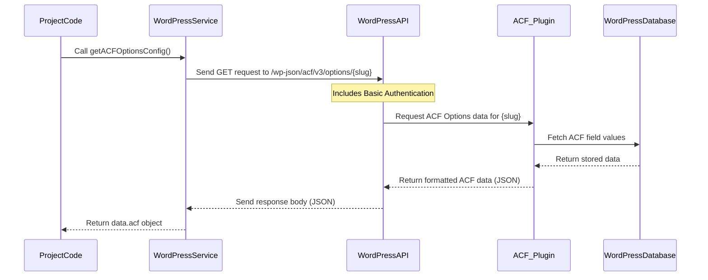

# Chapter 4: ACF Daily Configuration

In the last chapter, we explored the [WordPress Service](03_wordpress_service_.md), which is the part of our project that knows how to talk to your WordPress site to create posts, upload images, and fetch data.

Now, let's look at a crucial piece of data that the [WordPress Service](03_wordpress_service_.md) fetches and that the project relies on: the **ACF Daily Configuration**.

## What is the ACF Daily Configuration?

Imagine your WordPress site needs a specific set of instructions for *each* day of the week (Monday through Saturday). For example:

*   On Monday, videos should go into the "Strength Training" category, and you have images available for Trainer A and Trainer B.
*   On Tuesday, videos should go into the "Cardio" category, and you only have images for Trainer C.

Instead of putting these rules directly into the project's code (which would require changing the code every time you change a category or a trainer!), we store these settings directly in WordPress using the **Advanced Custom Fields (ACF)** plugin.

The **ACF Daily Configuration** is simply **these specific settings, organized by day, and stored in a special place in your WordPress site using ACF.**

Think of it like a "daily planner" or "template" that lives inside your WordPress admin area. For each day from Monday (Day 1) to Saturday (Day 6), it holds the answers to questions like:

*   Which WordPress **category** should the published video post belong to?
*   Which **trainers** teach on this day, and importantly, what are the **image IDs** in the WordPress Media Library for their pictures (specifically the first image)?

This configuration makes the project flexible. You can change categories or update trainer images directly in WordPress, and the project will automatically use the new settings without needing any code changes.

## Why is it Important for Publishing?

When the project goes to publish a video, it needs this information. It's a key step after finding the video on Vimeo and before creating the post in WordPress:

1.  Find the video on Vimeo ([Vimeo Service](02_vimeo_service_.md)).
2.  Determine which day of the week it is (or was specified).
3.  **Fetch the ACF Daily Configuration for that specific day from WordPress** ([WordPress Service](03_wordpress_service_.md)).
4.  Use the fetched configuration to know:
    *   Which category ID to assign to the new WordPress post.
    *   Which trainer options are available for this day so the [Telegram Service](01_telegram_service_.md) can ask you to choose one.
5.  Based on the chosen trainer from the [Telegram Service](01_telegram_service_.md), get the trainer's image ID from the daily configuration.
6.  Create the WordPress post with the correct category and featured image ID ([WordPress Service](03_wordpress_service_.md)).

Without this configuration, the project wouldn't know how to properly categorize the post or which trainer image to use for the featured image.

## How the Project Uses the Configuration

The project uses the [WordPress Service](03_wordpress_service_.md)'s functions to retrieve the ACF data. The main function for this is `getACFOptionsConfig()`.

Here's a simplified look at how the publishing logic uses this:

```typescript
import { getACFOptionsConfig } from "../services/wordpress"; // Import the function

async function publishVideoToWordPress(options: PublishVideoOptions) {
  const dayNumber = options.dayNumber || new Date().getDay(); // Get current day (1-6 for Mon-Sat)

  console.log("📋 Getting WordPress configuration...");
  // Call the function to fetch ALL the ACF daily config data
  const wpConfig = await getACFOptionsConfig();

  if (!wpConfig) {
    throw new Error("Could not get WordPress configuration");
  }

  // The fetched 'wpConfig' object now contains the data structured by day
  // For example, to get Monday's config (Day 1):
  const mondayConfig = wpConfig.config_day_1;

  // To get the category ID for today's class:
  const configKey = `config_day_${dayNumber}` as keyof typeof wpConfig;
  const todayConfig = wpConfig[configKey];

  if (!todayConfig || !todayConfig.category) {
      throw new Error(`No config or category found for day ${dayNumber}`);
  }

  const categoryId = todayConfig.category.term_id;
  console.log(`➡️ Using category ID: ${categoryId} for day ${dayNumber}`);

  // Later, when selecting a trainer via Telegram:
  // The Telegram Service also uses getACFOptionsConfig internally to build the buttons
  // Once you select a trainer (e.g., 'trainer_1'), the code looks up the image ID:
  const selectedTrainerKey = 'trainer_1'; // Example based on Telegram selection
  const trainerImageId = todayConfig.trainers[selectedTrainerKey].image_1;
  console.log(`➡️ Using image ID: ${trainerImageId} for trainer ${selectedTrainerKey}`);

  // ... rest of the publishing process uses categoryId and trainerImageId
}
```

As you can see, `getACFOptionsConfig()` fetches the *entire* daily configuration structure. The project then navigates through this structure (`wpConfig.config_day_X.category.term_id` or `wpConfig.config_day_X.trainers.trainer_Y.image_1`) to find the specific pieces of information needed for the current day and selected trainer.

The project expects the configuration data to have a specific structure, as defined by the ACF field names and group setup in your WordPress site. This structure looks something like this (using simplified types from `src/types/wordpress.ts`):

```typescript
interface VimeoWPConfig {
  config_day_1: DayConfig; // Contains config for Monday
  config_day_2: DayConfig; // Contains config for Tuesday
  // ... up to config_day_6 for Saturday
}

interface DayConfig {
  category: { // Details about the assigned category
    term_id: number; // The ID number of the category in WordPress
    name: string;    // The name of the category (e.g., "Strength Training")
    // ... other category details
  };
  trainers: { // Information about trainers for this day
    trainer_1: TrainerImages; // Details for Trainer 1
    trainer_2: TrainerImages; // Details for Trainer 2
    trainer_3: TrainerImages; // Details for Trainer 3
  };
}

interface TrainerImages {
  image_1: number;     // ID of the primary image for this trainer
  image_2: number | false; // Optional ID for a second image
}
```

This structure is created in your WordPress admin area when you set up the ACF fields. The project code relies on these exact field names (`config_day_1`, `category`, `trainers`, `trainer_1`, `image_1`, etc.) to access the data correctly.

## Under the Hood: Fetching the Configuration

How does `getACFOptionsConfig()` actually get this data from WordPress?

It uses the WordPress REST API, specifically an endpoint provided by the "ACF to REST API" plugin you need to install on your site. This plugin makes the data stored in ACF fields accessible via the API.

The process looks like this:



When `getACFOptionsConfig()` is called, it makes a web request (using `fetch`) to a specific URL on your WordPress site: `{YOUR_WORDPRESS_URL}/wp-json/acf/v3/options/{your_options_page_slug}`.

*   `/wp-json/` is the base path for the WordPress REST API.
*   `acf/v3/` is the path added by the "ACF to REST API" plugin.
*   `options/` means it's asking for data from an ACF Options Page.
*   `{your_options_page_slug}` is a unique identifier for the specific options page where you've set up the daily configuration fields (this slug is set in your `.env` file as `WORDPRESS_ACF_OPTIONS_SLUG`).

The request includes the necessary Basic Authentication (username and Application Password) to prove it has permission to access this data.

WordPress, with the help of the "ACF to REST API" plugin, finds the requested options page data in its database, formats it as a JSON object, and sends it back in the response. The `getACFOptionsConfig()` function receives this JSON, checks for errors, and extracts the part containing the ACF fields (`data.acf`) before returning it to the calling code.

Here's a simplified view of the relevant part of `src/services/wordpress.ts` that handles this:

```typescript
// ... imports and authHeader ...

const DEFAULT_ACF_OPTIONS_SLUG = WORDPRESS_ACF_OPTIONS_SLUG; // Get slug from environment

export async function getACFOptionsConfig(
  slug: string = DEFAULT_ACF_OPTIONS_SLUG
) {
  try {
    // Build the full URL for the ACF options API endpoint
    const apiUrl = `${WORDPRESS_URL}/wp-json/acf/v3/options/${slug}`;
    console.log(`Fetching ACF config from: ${apiUrl}`); // Log the URL being called

    const response = await fetch( // Make the web request
      apiUrl,
      {
        headers: { // Add headers, including authentication
          Authorization: `Basic ${authHeader}`,
          "Content-Type": "application/json",
        },
      }
    );

    // Check if the response was successful (status 200-299)
    if (!response.ok) {
      throw new Error(`HTTP error! status: ${response.status} - ${response.statusText}`);
    }

    // Parse the response body as JSON
    const data = await response.json();

    // The ACF data is typically nested under a top-level key, often also 'acf'
    if (!data || !data.acf) {
      console.error("Received unexpected data structure:", data);
      throw new Error("ACF response does not have the expected format");
    }

    // Return the part of the JSON that contains our ACF fields
    return data.acf;
  } catch (error) {
    console.error("❌ Error fetching ACF options config:", error);
    throw error;
  }
}

// There's also a helper function getDayConfig that calls getACFOptionsConfig
// and then extracts the specific day's configuration:
export async function getDayConfig(dayNumber: number) {
    const config = await getACFOptionsConfig(); // Get all config first
    const dayKey = `config_day_${dayNumber}` as keyof typeof config;
    // Return the config for the specific day, or null if not found
    return config[dayKey] || null;
}
```

This code snippet shows how the `fetch` function is used to call the specific API endpoint. It includes the `Authorization` header with the basic authentication details and expects the response to be in JSON format (`"Content-Type": "application/json"`). After getting the response, it parses the JSON and returns the `.acf` property, which holds the actual configuration data we set up in WordPress. The `getDayConfig` function then makes it even easier to access just the data for a single day.

## Conclusion

The **ACF Daily Configuration** is a smart way to keep important publishing settings like categories and trainer image references external to the project's code, stored instead in your familiar WordPress admin area. The [WordPress Service](03_wordpress_service_.md) is responsible for fetching this configuration using the WordPress REST API and the "ACF to REST API" plugin. This allows the project to be flexible and use the correct settings for publishing videos each day.

Now that we've covered the individual services for talking to Telegram, Vimeo, and WordPress, and understand how WordPress stores daily settings using ACF, we have all the pieces to see how they work together in the full video publishing process. The next chapter will walk through the complete [Video Publishing Use Case](05_video_publishing_use_case_.md).

---

<sub><sup>Generated by [AI Codebase Knowledge Builder](https://github.com/The-Pocket/Tutorial-Codebase-Knowledge).</sup></sub> <sub><sup>**References**: [[1]](https://github.com/Jarrioja/vimeo-to-wp/blob/2da693d29af45c519c030c2692b3d009d32b4568/README.md), [[2]](https://github.com/Jarrioja/vimeo-to-wp/blob/2da693d29af45c519c030c2692b3d009d32b4568/src/scripts/check-connection.ts), [[3]](https://github.com/Jarrioja/vimeo-to-wp/blob/2da693d29af45c519c030c2692b3d009d32b4568/src/services/telegram.ts), [[4]](https://github.com/Jarrioja/vimeo-to-wp/blob/2da693d29af45c519c030c2692b3d009d32b4568/src/services/wordpress.ts), [[5]](https://github.com/Jarrioja/vimeo-to-wp/blob/2da693d29af45c519c030c2692b3d009d32b4568/src/types/wordpress.ts), [[6]](https://github.com/Jarrioja/vimeo-to-wp/blob/2da693d29af45c519c030c2692b3d009d32b4568/src/use-cases/publish-video-to-wordpress.ts)</sup></sub>