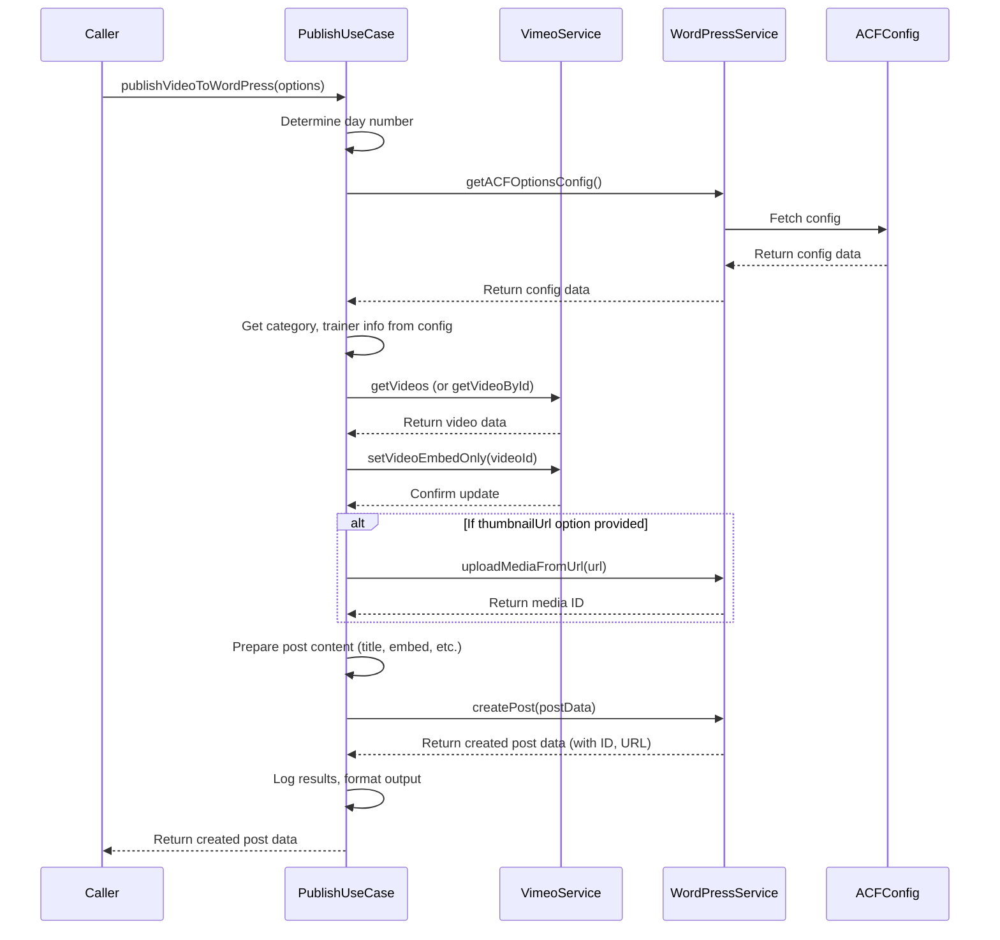

# Chapter 5: Video Publishing Use Case

Welcome back! In our journey so far, we've met the individual helpers: the [Telegram Service](01_telegram_service_.md) for talking to you, the [Vimeo Service](02_vimeo_service_.md) for getting videos, the [WordPress Service](03_wordpress_service_.md) for managing your website content, and the [ACF Daily Configuration](04_acf_daily_configuration_.md) for storing daily settings on WordPress.

Now, it's time to bring them all together! This chapter is about the **Video Publishing Use Case**. Think of this as the complete "recipe" or the main story of how a video goes from Vimeo to a published post on your WordPress site, guided by our project.

## What is the Video Publishing Use Case?

At its heart, the `vimeo-to-wp` project exists to solve one main problem: **automatically taking a specific video from Vimeo, preparing it, and creating a properly formatted blog post for it on WordPress.**

The **Video Publishing Use Case** is the term we use for the entire, step-by-step process that makes this happen. It's the master plan that coordinates all the individual services we've discussed.

Imagine it like this: you want to publish today's video class. Instead of manually downloading the video, logging into Vimeo to change settings, logging into WordPress, writing a post, embedding the video, uploading a featured image, setting the category, and clicking publish... you can just tell our project to do it!

The Video Publishing Use Case is the sequence of actions the project takes when you trigger it (e.g., by sending a Telegram command or via an automated schedule).

## The Publishing Recipe: Step-by-Step

Here's the "recipe" that the project follows in the main publishing use case:

1.  **Start the Process:** The process begins. This could be because you sent a command like `/publicar` via Telegram or because a scheduled task kicked off.
2.  **Find the Video:** The project needs to know *which* video to publish. It asks the **[Vimeo Service](02_vimeo_service_.md)** to find the most recent video (or a specific video if you provided an ID).
3.  **Get Daily Configuration:** To know *how* to format the post, the project needs the settings for today. It asks the **[WordPress Service](03_wordpress_service_.md)** to fetch the **[ACF Daily Configuration](04_acf_daily_configuration_.md)** for the current day of the week.
4.  **Interact for Input (Optional but common):** If using the Telegram bot, the project might ask you questions using the **[Telegram Service](01_telegram_service_.md)**. A key question is usually "Which trainer's image should I use for the featured image?", presenting you with options based on the [ACF Daily Configuration](04_acf_daily_configuration_.md) for today.
5.  **Prepare Video on Vimeo:** *Before* embedding, the project tells the **[Vimeo Service](02_vimeo_service_.md)** to update the video's privacy settings so it can only be embedded on your allowed websites.
6.  **Upload Featured Image:** Based on your selection (or a default), the project takes the URL of the trainer's image (found in the [ACF Daily Configuration](04_acf_daily_configuration_.md)) and asks the **[WordPress Service](03_wordpress_service_.md)** to upload it to your WordPress Media Library.
7.  **Create WordPress Post:** Using the video details (title, embed code, description) from the **[Vimeo Service](02_vimeo_service_.md)**, the category ID from the **[ACF Daily Configuration](04_acf_daily_configuration_.md)**, and the featured image ID returned by the **[WordPress Service](03_wordpress_service_.md)**'s upload step, the project tells the **[WordPress Service](03_wordpress_service_.md)** to create a new post.
8.  **Publish or Draft:** The project sets the post's status to either 'publish' or 'draft' when creating it (depending on how it was triggered). If set to 'draft', a separate step could later update it using the **[WordPress Service](03_wordpress_service_.md)**'s `publishPost` function.
9.  **Report Result:** Finally, the project uses the **[Telegram Service](01_telegram_service_.md)** to send you a message confirming success and providing the link to the new WordPress post.

This entire sequence is what we mean by the "Video Publishing Use Case".

## Using the Publishing Use Case in Code

The core logic for this entire sequence is put into a single function called `publishVideoToWordPress`. This function lives in the `src/use-cases/publish-video-to-wordpress.ts` file. This file is specifically named `use-cases` because it represents one of the main ways the project is *used*.

Other parts of the project, like the Telegram bot script (`telegram-bot.ts`) or a command-line script (`publish-video.ts`), simply need to call this `publishVideoToWordPress` function, providing it with any necessary options.

Here's how the `publish-video.ts` script uses it (simplified from the provided code):

```typescript
import { publishVideoToWordPress } from "../use-cases/publish-video-to-wordpress";

// ... (code to get dayNumber and videoId from command line arguments) ...

async function testPublishVideo() {
  try {
    console.log("🚀 Starting video publishing process...");

    // Call the main function that does everything
    await publishVideoToWordPress({
      dayNumber,   // Provide the day number (optional, defaults to today)
      videoId,     // Provide the Vimeo video ID (optional, defaults to latest)
      forcePublish: true, // Tell it to publish immediately
      // thumbnailUrl would be provided if this script handled image selection
    });

    console.log("🎉 Process completed!");
  } catch (error) {
    console.error("❌ An error occurred:", error);
    // ... (handle error) ...
  }
}

testPublishVideo(); // Run the process
```

This script is very simple because the `publishVideoToWordPress` function does all the heavy lifting. The script just tells it which video and day to use and whether to publish.

Similarly, the `telegram-bot.ts` script calls `publishVideoToWordPress` after getting the video and trainer choice from the user (simplified):

```typescript
import { publishVideoToWordPress } from "../use-cases/publish-video-to-wordpress";
import { TelegramService } from "../services/telegram";
import { VimeoService } from "../services/vimeo";

const telegram = new TelegramService();
const vimeo = new VimeoService();

async function publishLatestVideo() {
  try {
    // ... (code to get latest video from Vimeo Service) ...
    const latestVideo = await vimeo.getLatestVideo();
    // ... (handle if no video) ...

    // ... (code to ask user for publishing via Telegram Service) ...
    const shouldPublish = await telegram.askForPublishing(latestVideo.link);
    if (!shouldPublish) return;

    // ... (code to ask user for trainer image via Telegram Service) ...
    const thumbnailUrl = await telegram.askForTrainer(/* ... dayNumber ... */);

    // Call the main function with collected info
    const result = await publishVideoToWordPress({
      videoId: latestVideo.uri.split("/").pop()!, // Pass the Vimeo ID
      dayNumber: new Date().getDay(), // Pass today's day
      thumbnailUrl: thumbnailUrl,     // Pass the selected image URL
      forcePublish: true,             // Tell it to publish immediately
    });

    // ... (code to report success via Telegram Service) ...
    await telegram.sendSuccessMessage(`Post published! ${result.link}`);

  } catch (error) {
    // ... (report error via Telegram Service) ...
  }
}

// ... (Telegram command setup that calls publishLatestVideo) ...
telegram.onCommand("publicar", publishLatestVideo);
```

Again, the `publishLatestVideo` function in the Telegram bot script focuses on interacting with the user and calling `publishVideoToWordPress` with the necessary information (`videoId`, `dayNumber`, `thumbnailUrl`).

The `publishVideoToWordPress` function is designed to be the central orchestrator for the entire publishing workflow.

## Under the Hood: How the Use Case Orchestrates Services

The `publishVideoToWordPress` function doesn't do everything itself. Instead, it calls methods from the other service classes and processes their results to move through the publishing steps.

Here's a simplified diagram showing the main interactions within the use case logic:



*Note: The Telegram Service interaction (steps 4 & 9 in the recipe above) is handled *outside* the `publishVideoToWordPress` function in `telegram-bot.ts`. The `publishVideoToWordPress` function receives the `thumbnailUrl` as an option, assuming any user interaction for trainer selection has already happened.*

Let's look at some simplified code snippets from `src/use-cases/publish-video-to-wordpress.ts` to see how these steps are implemented:

```typescript
import { VimeoService } from "../services/vimeo";
import {
  createPost,
  getACFOptionsConfig,
  uploadMediaFromUrl,
  // publishPost // Not explicitly called here if using status: 'publish'
} from "../services/wordpress";

// Interface defining the expected options
export interface PublishVideoOptions {
  videoId: string;
  dayNumber?: number;
  thumbnailUrl?: string; // URL of the image selected by user/caller
  forcePublish?: boolean;
}

export async function publishVideoToWordPress(options: PublishVideoOptions) {
  // Step 1 & 2: Determine day and initialize services
  const dayNumber = options.dayNumber || new Date().getDay();
  const vimeoService = new VimeoService(); // Use the Vimeo Service

  // Step 3: Get configuration from WordPress
  console.log("📋 Getting config...");
  const wpConfig = await getACFOptionsConfig(); // Use WordPress Service function
  // ... (validation of wpConfig structure) ...
  const dayConfig = wpConfig[`config_day_${dayNumber}`];
  const categoryId = dayConfig.category.term_id; // Get category ID from config

  // Step 2 (cont.): Get video details
  console.log("📹 Getting video...");
  let video;
  if (options.videoId) {
      video = await vimeoService.getVideoById(options.videoId); // Get specific video
  } else {
      const videos = await vimeoService.getVideos({ per_page: 1, sort: "date", direction: "desc" }); // Get latest
      video = videos.data[0];
  }
  // ... (validation of video) ...

  // Step 5: Prepare Video on Vimeo (set embed-only privacy)
  console.log("🔒 Setting Vimeo privacy...");
  await vimeoService.setVideoEmbedOnly(video.uri.split("/").pop()!); // Use Vimeo Service function

  // Step 6: Upload Featured Image (if URL was provided)
  let featuredMediaId: number | undefined;
  if (options.thumbnailUrl) {
    console.log("🖼️ Uploading image...");
    // Use WordPress Service function to upload from URL
    featuredMediaId = await uploadMediaFromUrl(options.thumbnailUrl);
  }

  // Step 7 & 8: Create WordPress Post
  console.log("📝 Creating post...");
  const post = await createPost({ // Use WordPress Service function
    title: "Generated Title Here", // Title formatted in a helper function
    content: `<div class="video-container">${video.embed.html}</div>`, // Use embed code from video
    status: options.forcePublish ? "publish" : "draft", // Set status based on option
    categoria_de_clase_grabada: [categoryId], // Use category ID from config
    featured_media: featuredMediaId, // Use uploaded image ID (if any)
    acf: { /* ... data for ACF fields in the post ... */ } // Include other video/day data in ACF
  });

  console.log("✅ Post created:", post.link);

  // Step 9: Report result (handled by the caller, like telegram-bot.ts)
  // The post object returned by createPost includes the link
  return post; // Return the created post details
}
```

This simplified code shows how the `publishVideoToWordPress` function acts as the conductor, calling the necessary methods on the `VimeoService` and the functions within the `WordPressService` file in the correct order. It uses the data returned by one step (like the ACF config or the video details) as input for subsequent steps (like creating the post).

The actual `publishVideoToWordPress` function in `src/use-cases/publish-video-to-wordpress.ts` includes more detailed error handling, logging, and data formatting, but the core flow remains the same as outlined above.

## Conclusion

The **Video Publishing Use Case** is the central workflow that brings together all the components of the `vimeo-to-wp` project. It defines the sequence of actions – from finding the video and fetching configuration to interacting with the user, preparing the video, uploading media, creating the WordPress post, and reporting the outcome. The `publishVideoToWordPress` function encapsulates this entire recipe, making it easy for other parts of the project (like the Telegram bot or command-line scripts) to trigger the full process.

You now have a good understanding of how the project's different services and configurations work together to achieve the main goal: automated video publishing.

Before you can run any of this code, however, you need to tell the project your specific details, like your Vimeo API keys, your WordPress site URL and credentials, and your Telegram bot token and chat ID. The final chapter will guide you through setting up the [Environment Configuration](06_environment_configuration_.md).

---

<sub><sup>Generated by [AI Codebase Knowledge Builder](https://github.com/The-Pocket/Tutorial-Codebase-Knowledge).</sup></sub> <sub><sup>**References**: [[1]](https://github.com/Jarrioja/vimeo-to-wp/blob/2da693d29af45c519c030c2692b3d009d32b4568/src/scripts/publish-video.ts), [[2]](https://github.com/Jarrioja/vimeo-to-wp/blob/2da693d29af45c519c030c2692b3d009d32b4568/src/scripts/telegram-bot.ts), [[3]](https://github.com/Jarrioja/vimeo-to-wp/blob/2da693d29af45c519c030c2692b3d009d32b4568/src/use-cases/publish-video-to-wordpress.ts)</sup></sub>