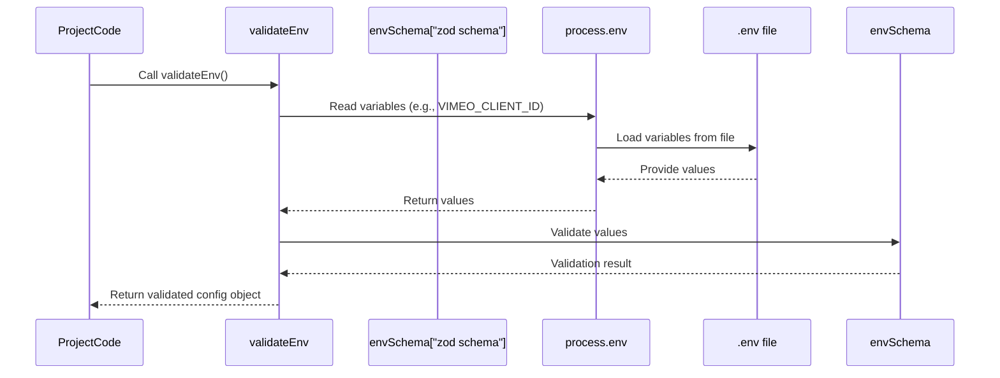

# Chapter 6: Environment Configuration

Welcome to the final chapter of our `vimeo-to-wp` tutorial! We've explored all the different parts of the project: the [Telegram Service](01_telegram_service_.md) for interacting with you, the [Vimeo Service](02_vimeo_service_.md) for getting video details, the [WordPress Service](03_wordpress_service_.md) for managing content on your site, and the [ACF Daily Configuration](04_acf_daily_configuration_.md) stored in WordPress to guide the process. We even saw how all these pieces fit together in the [Video Publishing Use Case](05_video_publishing_use_case_.md).

But there's one crucial piece missing before the project can actually run: **How does the project know the specific details of *your* setup?** Where is your WordPress site? What are your login details? What are your secret keys for talking to Vimeo and Telegram?

This chapter is all about providing that essential information to the project. It's about **Environment Configuration**.

## What is Environment Configuration?

Imagine the `vimeo-to-wp` project is like a skilled assistant ready to work, but they need an address book and a set of keys to do their job.

*   They need the address of your WordPress site.
*   They need the username and password (or a special key) to log in.
*   They need the secret keys to unlock the connection to your Vimeo account.
*   They need the specific token and chat ID to find your Telegram bot and the chat you want to use.

**Environment Configuration** is simply the process of providing these specific details to the running program. It tells the project about the "environment" it's operating in – *your* Vimeo account, *your* WordPress site, *your* Telegram chat.

Instead of writing these sensitive details directly into the code (which is a bad idea for security!), we store them separately. This also makes the project flexible – you could easily run the *same* code for a different WordPress site or Vimeo account just by changing the configuration.

## Why Use Environment Variables and `.env` Files?

You might hear the term "environment variables". These are settings that live *outside* of your program's code, provided by the operating system or the environment where the program is running. Our project uses these.

The simplest and most common way to manage environment variables for development and testing is using a **`.env` file**.

Here's why `.env` files are great for this:

1.  **Security:** They keep your sensitive information (passwords, keys, tokens) out of your code files. This is super important if you're using a version control system like Git, as you should **never** commit your `.env` file to Git.
2.  **Flexibility:** You can easily change configuration settings (like switching between a test WordPress site and a live one) just by editing the `.env` file, without touching the project's code.
3.  **Organization:** All your project's settings are kept in one place.

The project uses a library that automatically reads the variables you define in a `.env` file located at the root of the project folder and makes them available as environment variables when the script runs.

## The `.env` File: Your Project's Address Book

Let's look at the file that holds all this crucial information. In the project, you'll find a file named `.env.example`. This file shows you *what* variables are needed, but it doesn't contain your actual secrets.

You need to create a copy of this file named just `.env` and fill it in with your specific details.

Here are the key variables you'll find (simplified from `.env.example`):

| Variable Name              | Purpose                                                                 | Where to Get It                                                                 |
| :------------------------- | :---------------------------------------------------------------------- | :------------------------------------------------------------------------------ |
| `VIMEO_CLIENT_ID`          | Identifies your application to Vimeo API.                               | Your Vimeo Developer App settings.                                              |
| `VIMEO_CLIENT_SECRET`      | A secret key for your Vimeo application.                                | Your Vimeo Developer App settings.                                              |
| `VIMEO_ACCESS_TOKEN`       | Allows the project to perform actions on your Vimeo account.          | Generate this token in your Vimeo Developer App settings. Needs 'Public' and 'Private' scopes. |
| `WORDPRESS_URL`            | The full web address of your WordPress site (e.g., `https://mysite.com`). | Your website's address.                                                         |
| `WORDPRESS_USERNAME`       | The username to access your WordPress site via the API.                 | A user on your WordPress site with API access. **Use a dedicated user.**        |
| `WORDPRESS_PASSWORD`       | The password for the WordPress user. **Use an Application Password!**   | Generate an "Application Password" in your WordPress user profile settings.   |
| `WORDPRESS_CPT`            | The slug (identifier) of the Custom Post Type for your video classes. | Defined in your WordPress theme/plugins. Often something like `post` or `clase-grabada`. |
| `WORDPRESS_VIMEO_META_KEY` | The meta key name for storing the Vimeo Video ID in WordPress.        | Defined when setting up ACF fields for the post type.                         |
| `WORDPRESS_ACF_OPTIONS_SLUG` | The slug (identifier) for your ACF Options Page with daily configs.     | Defined when setting up the ACF Options Page in WordPress. Default is often `options`. |
| `TELEGRAM_BOT_TOKEN`       | The secret token for your Telegram bot.                                 | Get this from the `@BotFather` bot in Telegram when you create your bot.        |
| `TELEGRAM_CHAT_ID`         | The specific Telegram chat ID the bot should listen to and send messages to.| Use your bot (e.g., send `/start`) and look in the logs, or use a helper bot like `@myidbot`. |

You must fill in accurate values for *all* these variables in your `.env` file.

## How the Project Accesses Configuration

The project includes a file `src/config/env.ts`. This file's main job is to read the environment variables (which are loaded from your `.env` file) and make sure they are all present and in the correct format (e.g., `WORDPRESS_URL` should be a valid URL).

It uses a library called `zod` to define what the configuration should look like and to perform validation.

Here's a simplified look at the `validateEnv` function from `src/config/env.ts`:

```typescript
import { z } from "zod"; // Library for validation

// Define the expected structure and types of our environment variables
const envSchema = z.object({
  VIMEO_CLIENT_ID: z.string().min(1), // Expects a non-empty string
  VIMEO_CLIENT_SECRET: z.string().min(1),
  VIMEO_ACCESS_TOKEN: z.string().min(1),
  WORDPRESS_URL: z.string().url(), // Expects a valid URL string
  WORDPRESS_USERNAME: z.string().min(1),
  WORDPRESS_PASSWORD: z.string().min(1),
  WORDPRESS_CPT: z.string().min(1),
  WORDPRESS_VIMEO_META_KEY: z.string().min(1),
  WORDPRESS_ACF_OPTIONS_SLUG: z.string().min(1),
  TELEGRAM_BOT_TOKEN: z.string(), // Expects a string
  TELEGRAM_CHAT_ID: z.string(),   // Expects a string
});

// This function reads, validates, and returns the environment variables
export function validateEnv() {
  // Read variables from process.env (where they are loaded from .env file)
  const env = {
    VIMEO_CLIENT_ID: process.env.VIMEO_CLIENT_ID,
    // ... include all other process.env variables ...
    TELEGRAM_CHAT_ID: process.env.TELEGRAM_CHAT_ID,
  };

  // Use zod to check if the 'env' object matches the 'envSchema' definition
  const result = envSchema.safeParse(env);

  if (!result.success) {
    // If validation fails, print errors and exit the program
    console.error("❌ Error de validación de variables de entorno:");
    // ... print detailed errors ...
    process.exit(1);
  }

  // If successful, return the validated data
  return result.data;
}
```

Any part of the project that needs access to the configuration calls `validateEnv()`. If the configuration is missing or incorrect, the program will stop with a helpful error message before it even tries to connect to any external service.

Here's a simple example of how a service uses it (from `src/services/vimeo.ts`):

```typescript
import { Vimeo } from "@vimeo/vimeo";
import { validateEnv } from "../config/env"; // Import the validation function

// Get the validated environment variables when the file is loaded
const env = validateEnv();

// Use the environment variables to create the Vimeo client instance
const vimeoClient = new Vimeo(
  env.VIMEO_CLIENT_ID,    // Use the ID from config
  env.VIMEO_CLIENT_SECRET,// Use the Secret from config
  env.VIMEO_ACCESS_TOKEN  // Use the Access Token from config
);

export class VimeoService {
  private client: Vimeo;

  constructor() {
    this.client = vimeoClient; // The service instance uses the client created with config
  }

  // ... other methods like getLatestVideo, setVideoEmbedOnly ...
}
```

As you can see, `validateEnv()` is called once to get the configuration (`const env = validateEnv();`). Then, the specific values (`env.VIMEO_CLIENT_ID`, etc.) are used when creating the `Vimeo` client object. The other services ([Telegram Service](01_telegram_service_.md), [WordPress Service](03_wordpress_service_.md)) access their required configuration values in a similar way.

This separation ensures that the core logic of the services doesn't need to know *how* the configuration is loaded, only that it will be available via the `env` object returned by `validateEnv()`.

Here's a simple diagram showing this flow:



This shows that when the project code starts and calls `validateEnv`, it reads from `process.env`, which in turn gets its values from the `.env` file. The `envSchema` checks if everything is correct.

## Setting Up Your Environment Configuration

Here are the steps you need to follow to set up your `.env` file:

1.  **Copy the example file:** In your project folder, find `.env.example`. Make a copy of this file in the same folder and name the copy `.env`.
    ```bash
    cp .env.example .env
    ```
2.  **Open `.env`:** Edit the newly created `.env` file in a text editor.
3.  **Fill in the values:** Go through each line in the `.env` file and replace the placeholder values (like `your_vimeo_client_id_here`) with your actual credentials and URLs.

    *   **Vimeo:** You need a Developer Account. Create an App if you haven't already. You'll find the Client ID and Client Secret there. You'll also need to generate an Access Token. Make sure the token has at least the `public` and `private` scopes (you'll check boxes when generating it).
    *   **WordPress URL:** Just the main address of your site, like `https://mycoolsite.com`.
    *   **WordPress Username/Password:** **Highly Recommended:** Create a new user in WordPress specifically for the API connection. Give it the lowest role necessary (e.g., Editor). Then, go to that user's profile page in WordPress admin, scroll down to "Application Passwords", give it a name (like `vimeo-api`), and click "Add New Application Password". WordPress will give you a unique, complex password **one time**. Use this password for `WORDPRESS_PASSWORD` and the dedicated username for `WORDPRESS_USERNAME`.
    *   **WordPress CPT & Vimeo Meta Key:** If your site uses a custom post type other than the default `post` for classes, put its slug here. If you used ACF to add a field to your post type to store the Vimeo video ID, put the field's name (the "Field Name" when you create the ACF field) here. The default `.env.example` values are common, but check your WordPress setup.
    *   **WordPress ACF Options Slug:** When you create an ACF Options Page in WordPress, you give it a "Menu Slug". Use that slug here. The default is often `options`.
    *   **Telegram Bot Token:** Talk to `@BotFather` in Telegram. It will give you instructions to create a new bot and provide you with the token.
    *   **Telegram Chat ID:** This is the trickiest one. The easiest way is often to send a message to your bot in the chat you want to use, then look at the logs when you run the script (`pnpm start` or `pnpm check:connection`). The log might show an incoming message with a `chat.id` property. Alternatively, you can add a bot like `@myidbot` to the group chat; when you type `/getid`, it will tell you the chat ID. Use the negative ID for group chats.

4.  **Save the file:** Save the `.env` file.
5.  **Keep it secret:** **Do not share this file**, and **do not commit it to Git** if you are using version control (your `.gitignore` file should already be set up to ignore `.env`).

Once your `.env` file is correctly filled out, the project's scripts (`pnpm start`, `pnpm check:connection`, etc.) will be able to load your specific settings and connect to the various services.

## Conclusion

Environment configuration is a fundamental step for any project that connects to external services or requires sensitive information. By using a `.env` file and environment variables, the `vimeo-to-wp` project keeps your credentials secure and makes it easy to adapt the project to your specific Vimeo account, WordPress site, and Telegram chat.

With your configuration in place, the project now knows *how* to talk to all the necessary platforms. You are ready to run the scripts and automate your video publishing workflow!

This concludes our tutorial for the `vimeo-to-wp` project. We hope this guide has helped you understand how the different parts work and how to set it up for your needs.

---

<sub><sup>Generated by [AI Codebase Knowledge Builder](https://github.com/The-Pocket/Tutorial-Codebase-Knowledge).</sup></sub> <sub><sup>**References**: [[1]](https://github.com/Jarrioja/vimeo-to-wp/blob/2da693d29af45c519c030c2692b3d009d32b4568/README.md), [[2]](https://github.com/Jarrioja/vimeo-to-wp/blob/2da693d29af45c519c030c2692b3d009d32b4568/src/config/env.ts)</sup></sub>