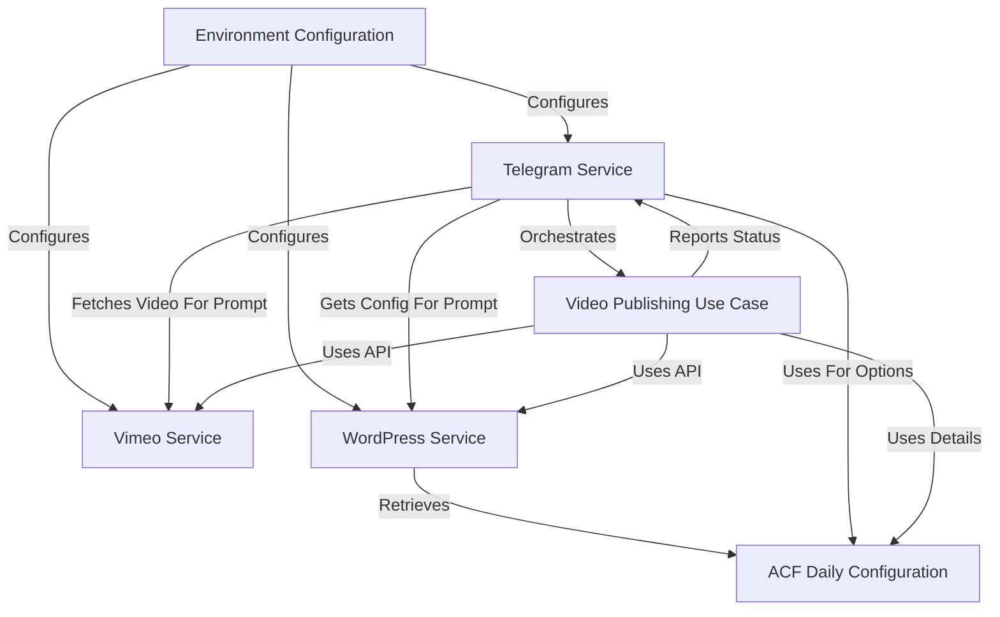

# Tutorial: vimeo-to-wp

This project automates the process of **publishing video classes** from *Vimeo* to a *WordPress* site.
It fetches the latest video from Vimeo, applies privacy settings, retrieves specific daily configuration (like category and trainer images) from WordPress using *ACF*, creates a new post with the video embed and a featured image, and publishes it.
The entire workflow is **triggered and controlled** interactively via a *Telegram bot*.

## Visual Overview

## Chapters

1. [Telegram Service
](01_telegram_service_.md)
2. [Vimeo Service
](02_vimeo_service_.md)
3. [WordPress Service
](03_wordpress_service_.md)
4. [ACF Daily Configuration
](04_acf_daily_configuration_.md)
5. [Video Publishing Use Case
](05_video_publishing_use_case_.md)
6. [Environment Configuration
](06_environment_configuration_.md)

---

Generated by [AI Codebase Knowledge Builder](https://github.com/The-Pocket/Tutorial-Codebase-Knowledge).